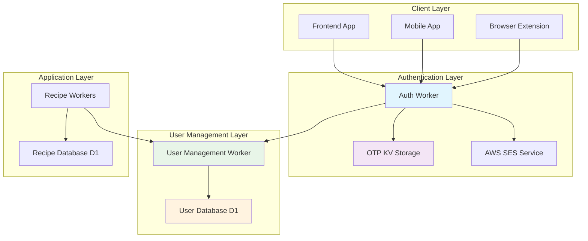
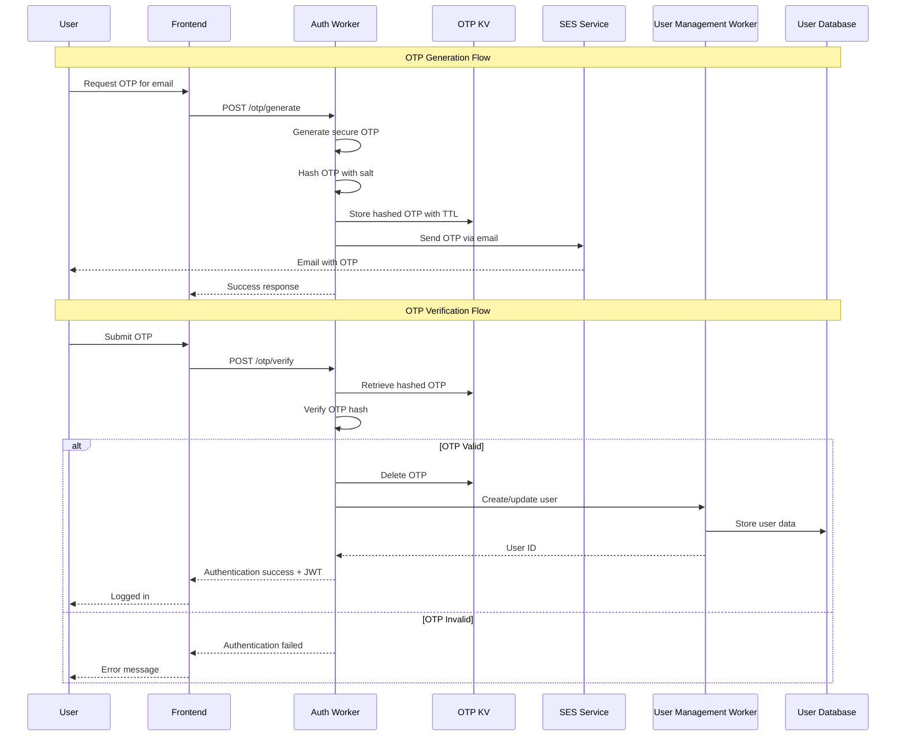
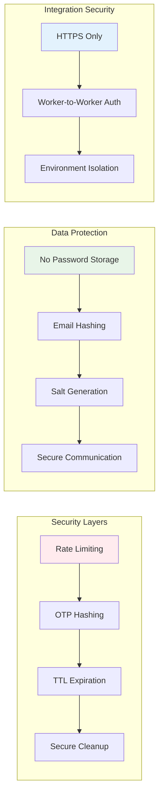
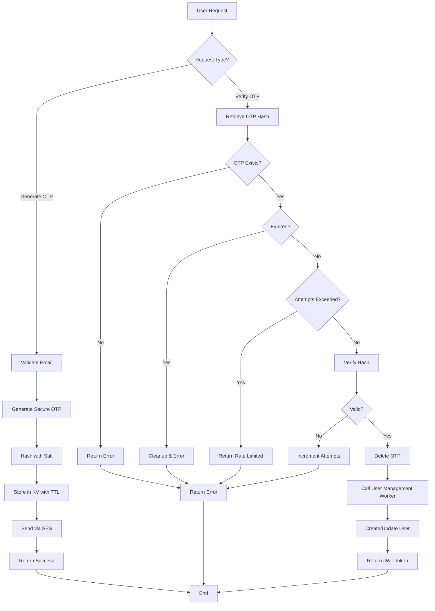
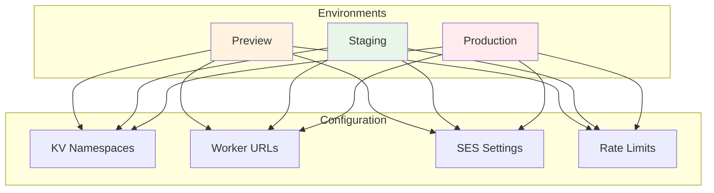
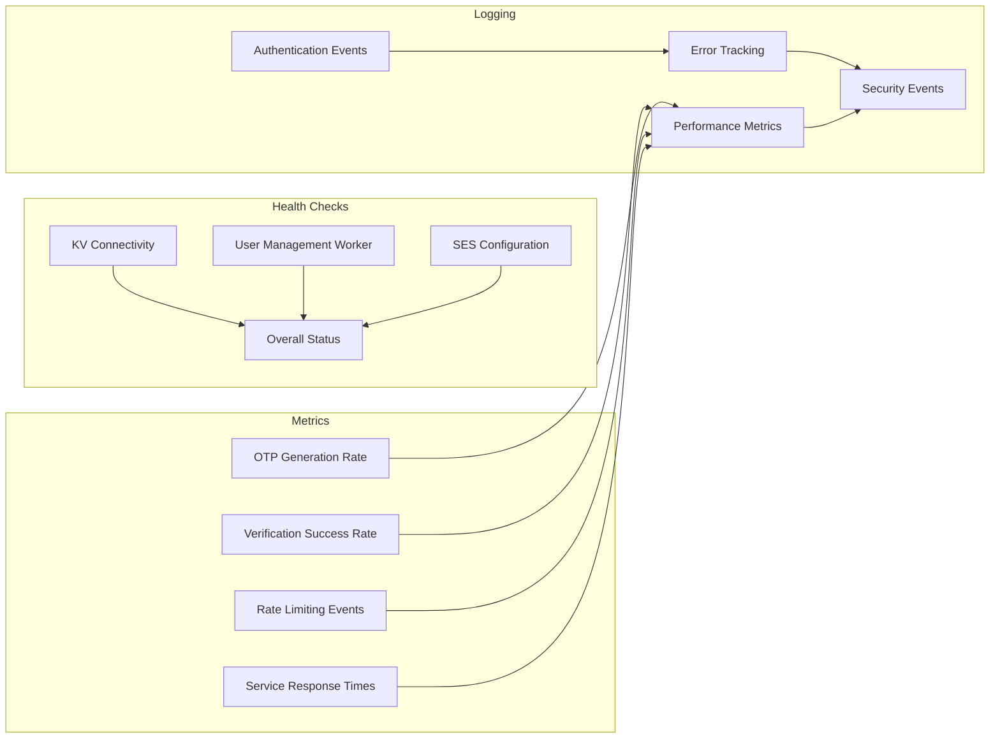

# Seasoned

A modern recipe management application with SQLite backend and image upload support, built with React frontend and Cloudflare Workers backend.

## Features

- ✨ **Recipe Management**: Create, read, update, and delete recipes
- 🖼️ **Image Upload**: Upload and store recipe images using Cloudflare R2
- 📋 **Recipe Clipping**: Automatically extract recipes from recipe websites with AI
- 💾 **SQLite Database**: Persistent storage using Cloudflare D1
- 🎨 **Modern UI**: Beautiful glassmorphism design with responsive layout
- 🔄 **Real-time Updates**: Instant updates across the application
- 🚀 **Smart Caching**: KV-based caching for improved performance and cost savings
- 📚 **Shared Libraries**: Reusable utilities across multiple workers

## Architecture

- **Frontend**: React with Vite
- **Backend**: Cloudflare Workers
- **Database**: Cloudflare D1 (SQLite)
- **Storage**: Cloudflare R2 for images
- **KV Storage**: Cloudflare KV for recipe caching
- **Shared Libraries**: Common utilities shared across workers
- **Deployment**: Cloudflare Workers

## Authentication System Architecture

The Seasoned application uses a modern, secure authentication system built around OTP (One-Time Password) technology, implemented as a dedicated Cloudflare Worker with clean separation of concerns.

### System Overview



### Authentication Flow



### Security Architecture



### Key Components

#### 1. **Auth Worker** (`auth-worker/`)
- **Purpose**: Handles all authentication operations
- **Responsibilities**:
  - OTP generation and verification
  - Rate limiting and security
  - Integration with User Management Worker
  - Email delivery via AWS SES
- **Technologies**: Cloudflare Workers, Hono.js, KV Storage

#### 2. **OTP Management System**
- **Storage**: Cloudflare KV with automatic TTL
- **Security**: SHA-256 hashing with unique salts
- **Expiration**: 5-minute TTL with automatic cleanup
- **Rate Limiting**: 3 attempts per OTP with cooldown

#### 3. **User Management Integration**
- **Separation**: Auth Worker never directly accesses user database
- **Communication**: HTTP calls to User Management Worker
- **Operations**: User creation, login tracking, profile updates
- **Security**: Environment-specific URLs and authentication

#### 4. **Email Service Integration**
- **Provider**: AWS SES for reliable email delivery
- **Templates**: Professional OTP delivery emails
- **Fallback**: Graceful degradation if email service unavailable
- **Security**: No sensitive data in email content

### Data Flow Architecture



### Environment Configuration

The auth worker supports multiple deployment environments:



### API Endpoints

| Endpoint | Method | Purpose | Request Body | Response |
|----------|--------|---------|--------------|----------|
| `/health` | GET | Service health check | None | Health status |
| `/otp/generate` | POST | Generate OTP | `{email: string}` | `{success: boolean, otp?: string}` |
| `/otp/verify` | POST | Verify OTP | `{email: string, otp: string}` | `{success: boolean, user_id?: string}` |

### Security Features

1. **OTP Security**
   - 6-digit numeric OTPs
   - SHA-256 hashing with unique salts
   - 5-minute expiration with automatic cleanup
   - Rate limiting (3 attempts per OTP)

2. **Data Protection**
   - No password storage
   - Email addresses hashed in KV keys
   - Secure worker-to-worker communication
   - Environment isolation

3. **Operational Security**
   - Comprehensive health monitoring
   - Automatic error handling and logging
   - Graceful degradation for service failures
   - Audit trail for authentication events

### Monitoring and Observability



This authentication architecture provides a secure, scalable, and maintainable solution for user authentication while maintaining clean separation of concerns and following security best practices.

### Workers:
- **auth-worker**: OTP-based authentication system with user management integration
- **user-management-worker**: User profile and account management
- **recipe-scraper**: Scrapes and stores recipe data from URLs
- **clipper**: Browser extension backend for recipe clipping
- **recipe-search-db**: Search functionality for recipes
- **recipe-save-worker**: Handles recipe saving operations
- **recipe-recommendation-worker**: Provides recipe recommendations
- **recipe-view-worker**: Serves shareable recipe pages

## Development Workflow

### Testing and Staging Deployment

This project follows a strict testing and staging deployment workflow to ensure code quality:

1. **Always Test First**: All code changes must pass tests before committing
2. **Feature Branches**: Work on feature branches, never directly on main
3. **Staging Validation**: Changes must be validated in staging before production
4. **Automated Testing**: Pre-commit hooks and GitHub Actions enforce testing

#### Quick Start

1. Install the pre-commit hook:
   ```bash
   ./.github/hooks/install-hooks.sh
   ```

2. Make your changes and commit (tests run automatically)

3. Push to staging when ready:
   ```bash
   ./push-to-staging.sh
   ```

4. After staging validation, create a PR to main

For detailed workflow rules, see `.cursorrules` in the project root.

## Setup Instructions

### Prerequisites

- Node.js 18+ installed
- Cloudflare account
- Wrangler CLI installed (`npm install -g wrangler`)

### 1. Backend Setup

The recipe app uses multiple specialized workers. Each worker can be set up independently:

#### Recipe Save Worker (Main Database)
```bash
cd recipe-save-worker
npm install
npm run deploy
```

#### Recipe Search Database
```bash
cd recipe-search-db
npm install
npm run deploy
```

#### Recipe Scraper
```bash
cd recipe-scraper
npm install
npm run deploy
```

#### Auth Worker
```bash
cd auth-worker
npm install
npm run deploy
```

#### User Management Worker
```bash
cd user-management-worker
npm install
npm run deploy
```

For detailed setup instructions for each worker, see their individual README files.

### 2. Frontend Setup

Navigate to the `frontend` directory:

```bash
cd frontend
```

Install dependencies:

```bash
npm install
```

Update the API URLs in your environment file (`frontend/.env.local`):

```bash
VITE_CLIPPER_API_URL=https://your-clipper-worker.your-subdomain.workers.dev
VITE_SEARCH_DB_URL=https://your-search-db.your-subdomain.workers.dev
VITE_SAVE_WORKER_URL=https://your-save-worker.your-subdomain.workers.dev
VITE_RECIPE_VIEW_URL=https://your-recipe-view-worker.your-subdomain.workers.dev
```

Start development server:

```bash
npm run dev
```

### 3. Configuration

**Important**: This project now uses environment variables to avoid hardcoded URLs and sensitive information. See [ENVIRONMENT_SETUP.md](ENVIRONMENT_SETUP.md) for detailed setup instructions.

#### Environment Variables Setup

1. **Copy example environment files:**
   ```bash
   # Frontend  
   cp frontend/.env.example frontend/.env.local
   ```

2. **Update the files with your actual values**

3. **Never commit these files** - they're already in `.gitignore`

#### Update wrangler.toml files

Each worker has its own `wrangler.toml` configuration file. Update the placeholder values in each worker's directory as needed. Refer to each worker's README for specific configuration requirements.

#### Configure R2 Public Access (Optional)

If you want direct image URLs:

1. Go to Cloudflare Dashboard > R2 > recipe-images
2. Enable public access
3. Update the image URL in your image handling worker configuration

## API Endpoints

### Recipes

- `GET /recipes` - Get all recipes
- `GET /recipe/:id` - Get recipe by ID
- `POST /recipe` - Create new recipe
- `PUT /recipe/:id` - Update recipe
- `DELETE /recipe/:id` - Delete recipe

### Image Upload

- `POST /upload-image` - Upload recipe image (multipart/form-data)

### Recipe Clipping

- `POST /clip` - Extract recipe from URL

## Database Schema

```sql
CREATE TABLE recipes (
    id INTEGER PRIMARY KEY AUTOINCREMENT,
    name TEXT NOT NULL,
    description TEXT,
    ingredients TEXT NOT NULL, -- JSON array as text
    instructions TEXT NOT NULL, -- JSON array as text
    image_url TEXT,
    source_url TEXT,
    created_at DATETIME DEFAULT CURRENT_TIMESTAMP,
    updated_at DATETIME DEFAULT CURRENT_TIMESTAMP
);
```

## Development

### Backend Development

Each worker can be developed independently:

```bash
# For recipe save worker
cd recipe-save-worker
npm run dev

# For recipe search database
cd recipe-search-db
npm run dev

# For recipe scraper
cd recipe-scraper
npm run dev
```

### Frontend Development

```bash
cd frontend
npm run dev
```

### Database Operations

```bash
# View database
wrangler d1 execute recipe-db --command="SELECT * FROM recipes;"

# Reset database
wrangler d1 execute recipe-db --file=./schema.sql
```

## Deployment

### Backend

Deploy each worker individually:

```bash
# Deploy recipe save worker
cd recipe-save-worker
npm run deploy

# Deploy recipe search database
cd recipe-search-db
npm run deploy

# Deploy recipe scraper
cd recipe-scraper
npm run deploy
```

### Frontend

The frontend is configured for deployment to **Cloudflare Pages** with multiple environment support.

#### Prerequisites

1. **Install Wrangler CLI** (if not already installed):
   ```bash
   npm install -g wrangler
   ```

2. **Login to Cloudflare**:
   ```bash
   wrangler login
   ```

#### Deploy to Cloudflare Pages

**Quick Deploy** (default environment):
```bash
cd frontend
npm run deploy
```

**Deploy to Staging**:
```bash
cd frontend
npm run deploy:staging
```

**Deploy to Production**:
```bash
cd frontend
npm run deploy:prod
```

#### What Happens During Deployment

1. **Build**: Runs `npm run build` to create optimized production files in `dist/` folder
2. **Deploy**: Uses `wrangler pages deploy dist` to upload to Cloudflare Pages
3. **URL**: 
   - **Production** (main branch): `https://seasoned-frontend.pages.dev`
   - **Staging** (staging branch): `https://seasoned-frontend.pages.dev` (preview deployment)
   - **Custom domain** if configured

#### Alternative Deployment Options

If you prefer other hosting services, you can build manually and deploy the `dist/` folder:

```bash
cd frontend
npm run build
```

Then upload the `dist/` folder contents to:
- **Netlify**: Drag and drop the `dist` folder
- **Vercel**: Connect your repo for auto-deployment
- **GitHub Pages**: Push to `gh-pages` branch
- **Any static hosting**: Upload `dist` folder contents

#### Environment Configuration

Before deploying, ensure your environment variables are set in `frontend/.env.local`:

```bash
VITE_API_URL=https://your-worker.your-subdomain.workers.dev
VITE_CLIPPER_API_URL=https://your-clipper-worker.your-subdomain.workers.dev
```

#### Local Preview

Preview your production build locally before deploying:

```bash
cd frontend
npm run build
npm run preview
```

## Troubleshooting

### Common Issues

1. **Database Connection Error**: Ensure D1 database is created and ID is correct in `wrangler.toml`
2. **Image Upload Fails**: Check R2 bucket permissions and binding
3. **CORS Errors**: Verify CORS headers are properly set in the worker
4. **Recipe Not Found**: Check if the database schema was applied correctly

### Debug Mode

Enable debug logging in the worker by adding console.log statements or using Wrangler's built-in logging:

```bash
wrangler tail
```

## Contributing

1. Fork the repository
2. Create a feature branch
3. Make your changes
4. Test thoroughly
5. Submit a pull request

## License

MIT License - see LICENSE file for details

## Documentation

- [Worker Coverage Setup](WORKER_COVERAGE_SETUP.md) - Details on test coverage for workers
- [Environment Setup](ENVIRONMENT_SETUP.md) - Setting up your development environment
- [Deployment Setup](DEPLOYMENT_SETUP.md) - Deploying to Cloudflare
- [Branch Strategy](BRANCH_STRATEGY.md) - Git workflow and branching
- [Staging Setup](STAGING_SETUP.md) - Setting up staging environment with database isolation

## Support

For issues and questions:
- Check the troubleshooting section
- Review Cloudflare Workers documentation
- Open an issue on GitHub
