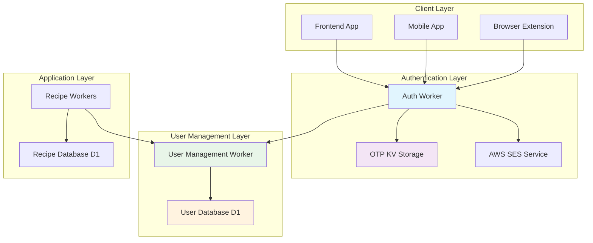
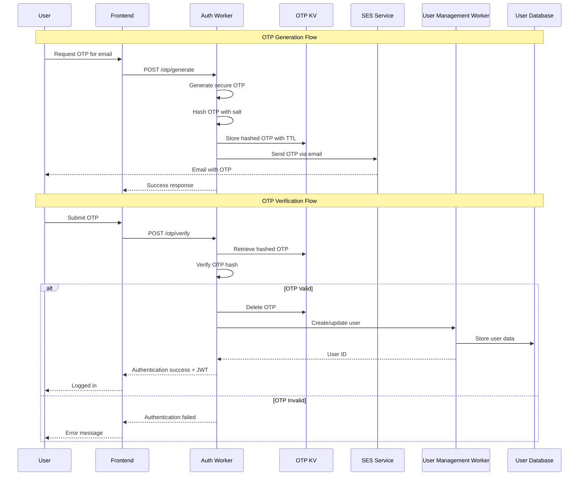
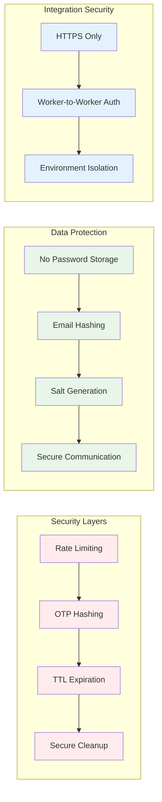
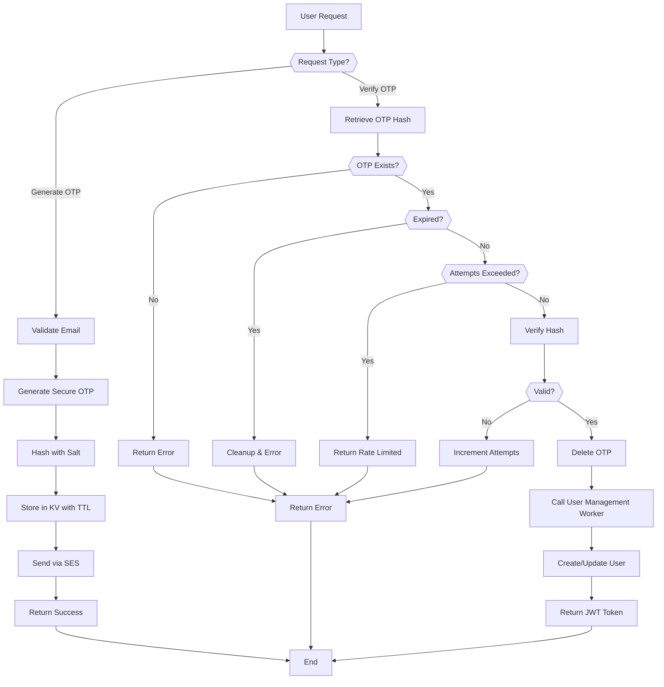
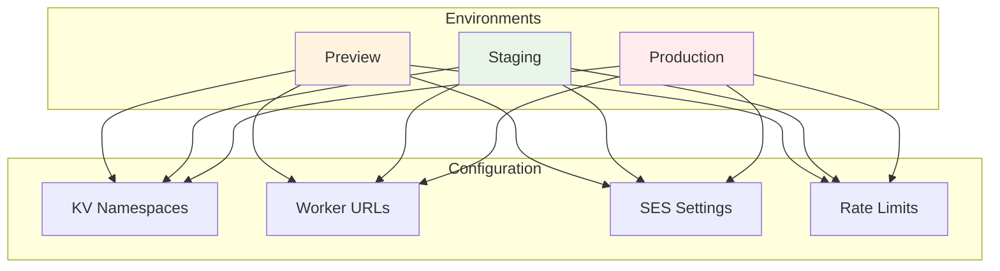
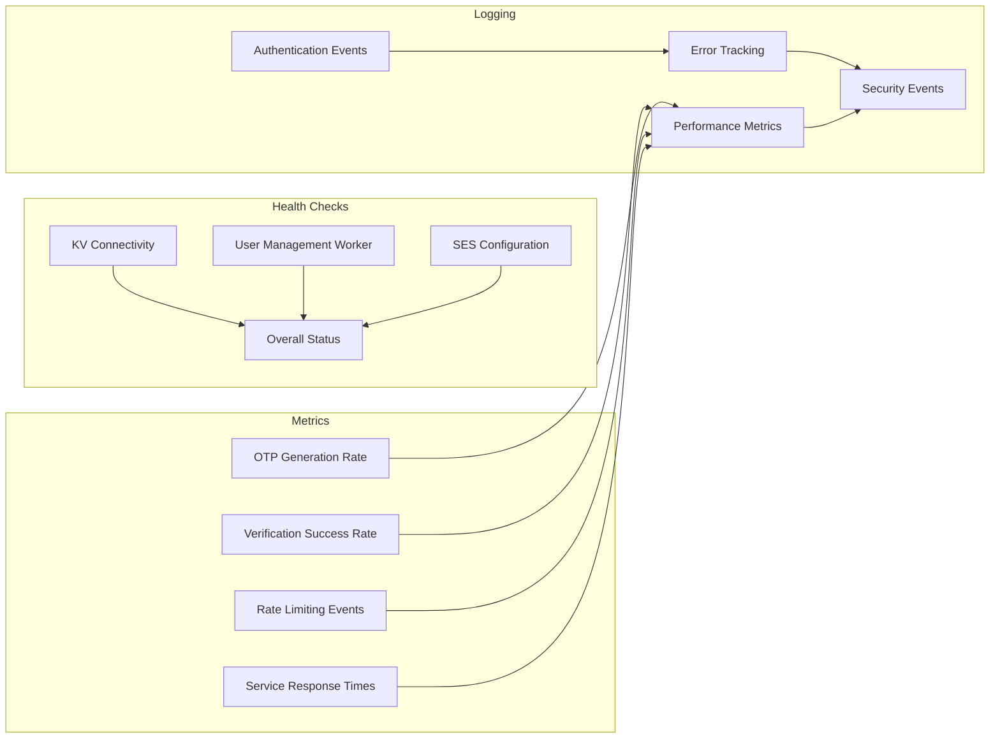

# Authentication System Architecture

The Seasoned application uses a modern, secure authentication system built around OTP (One-Time Password) technology, implemented as a dedicated Cloudflare Worker with clean separation of concerns.

## System Overview

## Authentication Flow

## Security Architecture

## Key Components

### 1. **Auth Worker** (`auth-worker/`)
- **Purpose**: Handles all authentication operations
- **Responsibilities**:
  - OTP generation and verification
  - Rate limiting and security
  - Integration with User Management Worker
  - Email delivery via AWS SES
- **Technologies**: Cloudflare Workers, Hono.js, KV Storage

### 2. **OTP Management System**
- **Storage**: Cloudflare KV with automatic TTL
- **Security**: SHA-256 hashing with unique salts
- **Expiration**: 5-minute TTL with automatic cleanup
- **Rate Limiting**: 3 attempts per OTP with cooldown

### 3. **User Management Integration**
- **Separation**: Auth Worker never directly accesses user database
- **Communication**: HTTP calls to User Management Worker
- **Operations**: User creation, login tracking, profile updates
- **Security**: Environment-specific URLs and authentication

### 4. **Email Service Integration**
- **Provider**: AWS SES for reliable email delivery
- **Templates**: Professional OTP delivery emails
- **Fallback**: Graceful degradation if email service unavailable
- **Security**: No sensitive data in email content

## Data Flow Architecture

## Environment Configuration

The auth worker supports multiple deployment environments:

## API Endpoints

| Endpoint | Method | Purpose | Request Body | Response |
|----------|--------|---------|--------------|----------|
| `/health` | GET | Service health check | None | Health status |
| `/otp/generate` | POST | Generate OTP | `{email: string}` | `{success: boolean, otp?: string}` |
| `/otp/verify` | POST | Verify OTP | `{email: string, otp: string}` | `{success: boolean, user_id?: string}` |

## Security Features

1. **OTP Security**
   - 6-digit numeric OTPs
   - SHA-256 hashing with unique salts
   - 5-minute expiration with automatic cleanup
   - Rate limiting (3 attempts per OTP)

2. **Data Protection**
   - No password storage
   - Email addresses hashed in KV keys
   - Secure worker-to-worker communication
   - Environment isolation

3. **Operational Security**
   - Comprehensive health monitoring
   - Automatic error handling and logging
   - Graceful degradation for service failures
   - Audit trail for authentication events

## Monitoring and Observability

This authentication architecture provides a secure, scalable, and maintainable solution for user authentication while maintaining clean separation of concerns and following security best practices.