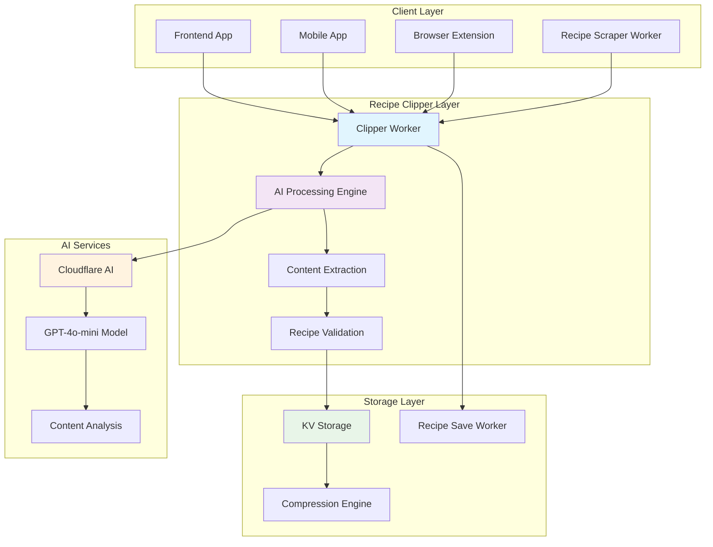
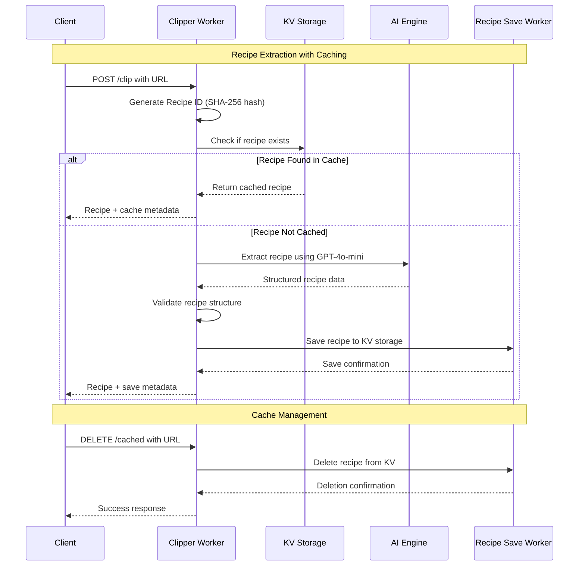
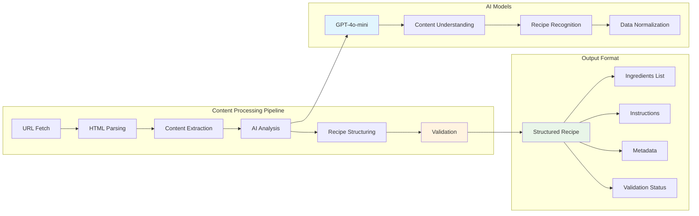
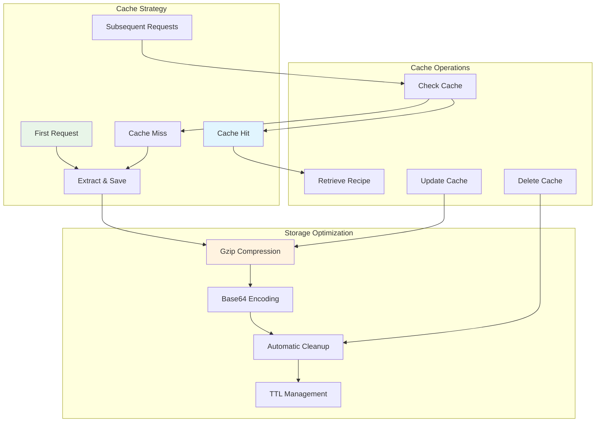
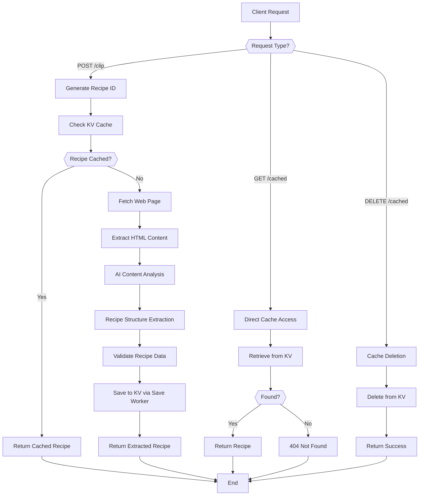
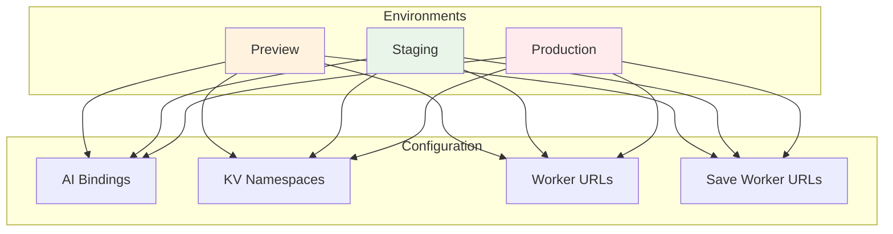
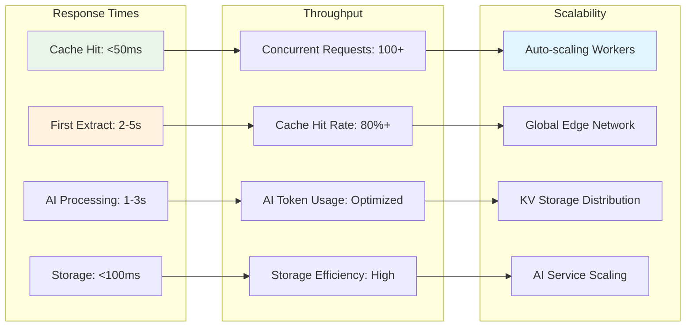
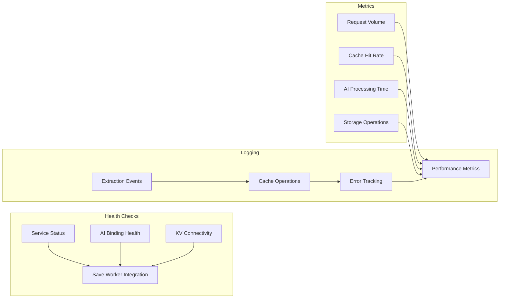

# Recipe Clipper Worker Architecture

The Recipe Clipper Worker is a specialized Cloudflare Worker service that extracts structured recipe data from web pages using AI-powered content analysis and intelligent caching strategies.

## System Overview

## Recipe Extraction Flow

## AI-Powered Content Extraction

## Caching Architecture

## Key Components

### 1. **Clipper Worker** (`clipper/src/`)
- **Purpose**: Orchestrates recipe extraction and caching
- **Responsibilities**:
  - URL validation and processing
  - Cache management and optimization
  - AI service integration
  - Recipe validation and structuring
  - Integration with Recipe Save Worker
- **Technologies**: Cloudflare Workers, AI bindings, KV storage

### 2. **AI Processing Engine**
- **Model**: GPT-4o-mini via Cloudflare AI
- **Capabilities**:
  - Web page content analysis
  - Recipe structure recognition
  - Ingredient and instruction extraction
  - Metadata identification
  - Content validation and normalization
- **Performance**: Optimized for recipe-specific content

### 3. **Caching System**
- **Storage**: Cloudflare KV with compression
- **Strategy**: First-extract-then-cache
- **Optimization**: Gzip compression + Base64 encoding
- **Management**: Automatic cache checking and updates
- **Integration**: Seamless with Recipe Save Worker

### 4. **Recipe Validation**
- **Structure**: Ensures consistent recipe format
- **Content**: Validates ingredients and instructions
- **Metadata**: Extracts cooking time, servings, difficulty
- **Quality**: AI-powered content quality assessment

## Data Flow Architecture

## Environment Configuration

The clipper worker supports multiple deployment environments:

## API Endpoints

| Endpoint | Method | Purpose | Request Body | Response |
|----------|--------|---------|--------------|----------|
| `/health` | GET | Service health check | None | Health status + features |
| `/clip` | POST | Extract recipe from URL | `{url: string, clearCache?: boolean}` | Recipe data + cache metadata |
| `/cached` | GET | Check cached recipe | Query: `url` | Cached recipe or 404 |
| `/cached` | DELETE | Clear recipe cache | Query: `url` | Success message |

## Integration Points

### 1. **Recipe Save Worker**
- **Purpose**: Centralized recipe storage management
- **Communication**: HTTP API calls
- **Operations**: Save, retrieve, delete recipes
- **Benefits**: Consistent storage patterns across workers

### 2. **Shared KV Storage**
- **Module**: `shared/kv-storage.js`
- **Functions**: Recipe ID generation, compression utilities
- **Compression**: Gzip + Base64 for storage optimization
- **Compatibility**: Works with both clipper and scraper workers

### 3. **AI Service Integration**
- **Provider**: Cloudflare Workers AI
- **Model**: GPT-4o-mini for content understanding
- **Binding**: Direct AI binding for optimal performance
- **Fallback**: Graceful degradation if AI service unavailable

## Performance Characteristics

## Security Features

1. **Input Validation**
   - URL format and domain validation
   - Request size limits and sanitization
   - CORS policy enforcement

2. **AI Service Security**
   - Environment-specific API keys
   - Rate limiting and abuse prevention
   - Secure worker-to-worker communication

3. **Data Protection**
   - Compressed storage for efficiency
   - No sensitive data exposure
   - Secure cache management

## Monitoring and Observability

## Error Handling and Resilience

1. **Graceful Degradation**
   - Continue operation if AI service fails
   - Fallback to cached content when possible
   - Informative error messages for debugging

2. **Retry Logic**
   - Automatic retry for transient failures
   - Exponential backoff for rate limits
   - Circuit breaker for persistent failures

3. **Monitoring and Alerting**
   - Real-time error tracking
   - Performance degradation alerts
   - Cache miss rate monitoring

## Future Enhancements

1. **Advanced Caching**
   - Intelligent cache invalidation
   - Multi-level caching strategies
   - Cache warming for popular recipes

2. **AI Model Optimization**
   - Recipe-specific fine-tuning
   - Multi-language support
   - Enhanced content validation

3. **Performance Improvements**
   - Edge-side caching optimization
   - Parallel processing for complex recipes
   - Predictive caching based on usage patterns

This architecture provides a robust, scalable, and efficient recipe extraction service that leverages AI capabilities while maintaining high performance through intelligent caching strategies.