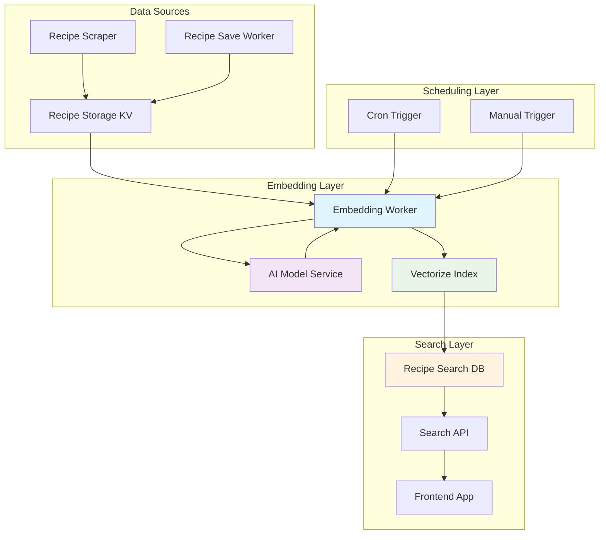
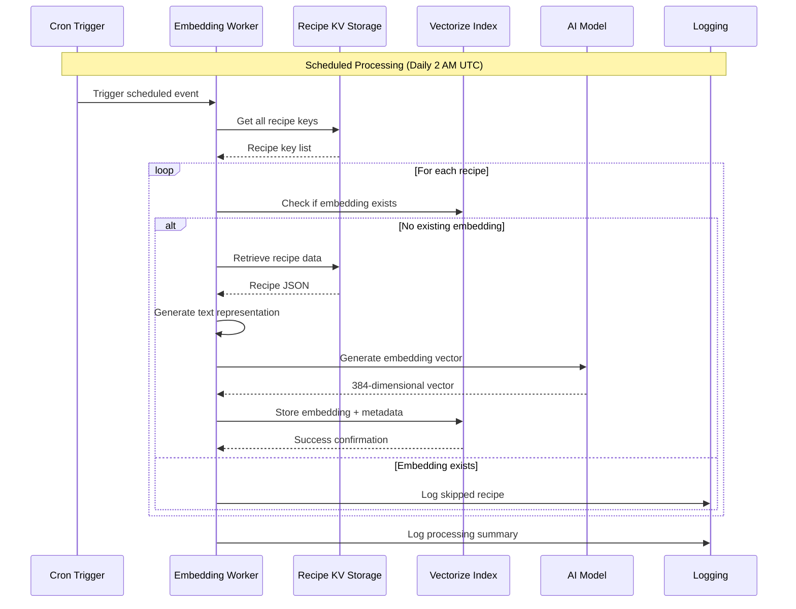
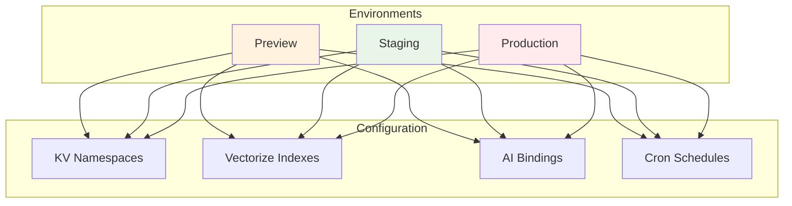
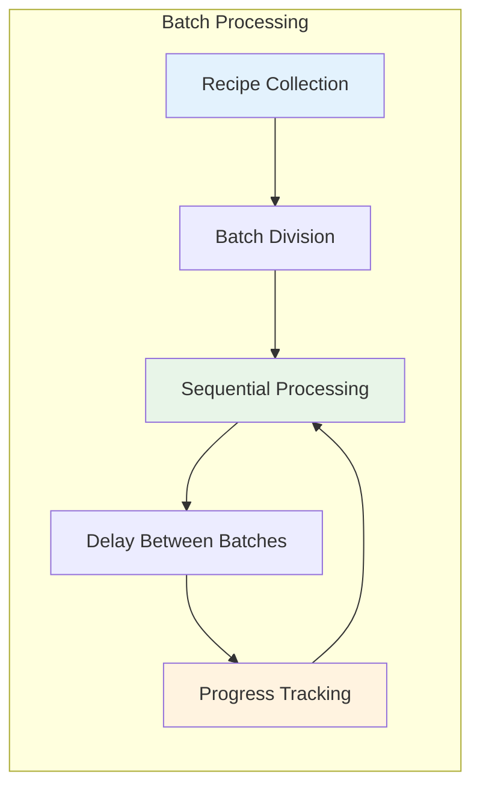
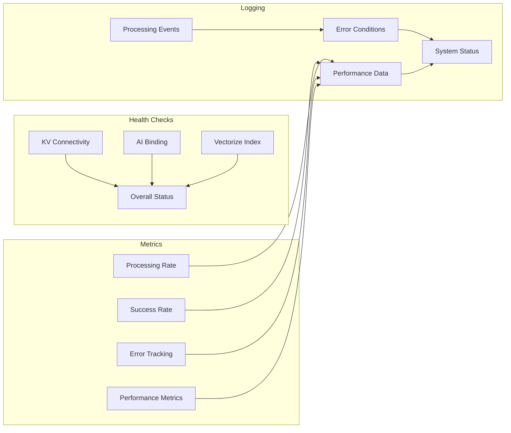

# Recipe Embedding System Architecture

The Seasoned application uses an intelligent recipe embedding system that generates vector representations of recipes for semantic search capabilities. This system is implemented as a dedicated Cloudflare Worker with scheduled processing and AI-powered embedding generation.

## System Overview



## Embedding Generation Flow



## AI Model Architecture

```mermaid
graph LR
    subgraph "Text Processing"
        A[Recipe Data]
        B[Text Generation]
        C[Text Truncation]
        D[Tokenization]
    end
    
    subgraph "AI Model"
        E[BGE Small EN v1.5]
        F[384 Dimensions]
        G[English Optimized]
        H[Semantic Understanding]
    end
    
    subgraph "Vector Output"
        I[Float32 Array]
        J[Normalized Vectors]
        K[Metadata Storage]
        L[Index Optimization]
    end
    
    A --> B
    B --> C
    C --> D
    D --> E
    E --> F
    F --> G
    G --> H
    H --> I
    I --> J
    J --> K
    K --> L
    
    style E fill:#ffebee
    style F fill:#ffebee
    style G fill:#ffebee
    style H fill:#ffebee
```



## Data Flow Architecture

```mermaid
flowchart TD
    A[Trigger Event] --> B{{Event Type?}}
    
    B -->|Scheduled| C[Daily Cron (2 AM UTC)]
    B -->|Manual| D[HTTP POST /embed]
    
    C --> E[Get All Recipe Keys]
    D --> E
    
    E --> F[Batch Processing]
    F --> G{{Recipe in Vectorize?}}
    
    G -->|Yes| H[Skip Recipe]
    G -->|No| I[Retrieve Recipe Data]
    
    I --> J[Parse Recipe JSON]
    J --> K[Generate Text Representation]
    K --> L[Truncate to 8000 chars]
    L --> M[Call AI Model]
    M --> N[Generate 384-dim Vector]
    N --> O[Store in Vectorize]
    O --> P[Update Processing Stats]
    
    H --> P
    P --> Q{{More Recipes?}}
    Q -->|Yes| F
    Q -->|No| R[Log Summary]
    R --> S[Return Results]
```

## Key Components

### 1. **Embedding Worker** (`recipe-embedding-worker/`)
- **Purpose**: Generates and manages recipe vector embeddings
- **Responsibilities**:
  - Scheduled daily processing at 2 AM UTC
  - Manual embedding generation via HTTP API
  - AI model integration for vector generation
  - Vectorize index management
  - Comprehensive monitoring and logging
- **Technologies**: Cloudflare Workers, AI Bindings, Vectorize, KV Storage

### 2. **AI Model Integration**
- **Model**: `@cf/baai/bge-small-en-v1.5`
- **Dimensions**: 384-dimensional vectors
- **Optimization**: English language optimized
- **Performance**: Fast inference with high semantic quality
- **Fallback**: Graceful degradation on AI service failures

### 3. **Vector Storage System**
- **Platform**: Cloudflare Vectorize
- **Index**: `recipe-vectors-384`
- **Metadata**: Rich recipe information for search optimization
- **Performance**: Optimized for similarity search queries
- **Scalability**: Handles large recipe collections efficiently

### 4. **Recipe Data Processing**
- **Source**: Compressed/uncompressed KV storage
- **Text Generation**: Comprehensive recipe representation including:
  - Recipe name and description
  - Ingredients list and quantities
  - Cooking instructions
  - Metadata (yield, cook time, keywords)
- **Optimization**: Text truncation to 8000 characters for model efficiency

## Environment Configuration

The embedding worker supports multiple deployment environments:



## API Endpoints

| Endpoint | Method | Purpose | Request Body | Response |
|----------|--------|---------|--------------|----------|
| `/` | GET | Worker information | None | Service details |
| `/health` | GET | Service health check | None | Health status |
| `/embed` | POST | Manual embedding generation | `{scheduled?: boolean}` | Processing results |

## Processing Architecture

### 1. **Scheduled Processing**
- **Frequency**: Daily at 2 AM UTC
- **Purpose**: Automatic embedding generation for new/updated recipes
- **Batch Size**: 10 recipes per batch
- **Optimization**: Delay between batches to prevent service overload

### 2. **Manual Processing**
- **Trigger**: HTTP POST to `/embed` endpoint
- **Use Cases**: Development, testing, urgent updates
- **Batch Size**: 5 recipes per batch
- **Response**: Detailed processing metrics and results

### 3. **Batch Processing Strategy**


## Performance Optimization

### 1. **Text Processing**
- **Truncation**: Limit text to 8000 characters for optimal model performance
- **Formatting**: Structured text generation for consistent embeddings
- **Metadata**: Rich context preservation for search relevance

### 2. **Vector Generation**
- **Model Efficiency**: BGE small model for fast inference
- **Batch Processing**: Optimized batch sizes for different scenarios
- **Error Handling**: Graceful degradation and retry logic

### 3. **Storage Optimization**
- **Duplicate Detection**: Skip existing embeddings to avoid reprocessing
- **Metadata Storage**: Efficient storage of recipe context
- **Index Performance**: Optimized Vectorize configuration

## Security and Reliability

### 1. **Data Protection**
- **Input Validation**: Comprehensive request validation
- **Error Sanitization**: Safe error message handling
- **CORS Configuration**: Proper cross-origin request handling

### 2. **Service Reliability**
- **Health Monitoring**: Comprehensive health checks
- **Error Recovery**: Graceful handling of service failures
- **Logging**: Detailed processing and error logging
- **Fallback Mechanisms**: Continued processing despite individual failures

### 3. **Resource Management**
- **Memory Efficiency**: Optimized data processing
- **Rate Limiting**: Controlled AI service usage
- **Timeout Handling**: Proper request timeout management

## Monitoring and Observability



### 1. **Health Monitoring**
- **KV Storage**: Connectivity and data access verification
- **AI Service**: Model availability and response time
- **Vectorize**: Index health and storage capacity
- **Overall Status**: Comprehensive service health assessment

### 2. **Performance Metrics**
- **Processing Speed**: Recipes processed per minute
- **Success Rate**: Successful embedding generation percentage
- **Error Tracking**: Detailed error categorization and frequency
- **Resource Usage**: Memory and CPU utilization monitoring

### 3. **Operational Insights**
- **Scheduling**: Cron trigger execution monitoring
- **Manual Triggers**: API usage and performance tracking
- **Batch Processing**: Efficiency and optimization opportunities
- **System Health**: Long-term performance trends

## Integration Points

### 1. **Recipe Storage Integration**
- **KV Namespace**: `RECIPE_STORAGE` for recipe data access
- **Data Format**: JSON with optional gzip compression
- **Update Detection**: Processing of new and modified recipes
- **Data Consistency**: Reliable recipe data retrieval

### 2. **Search System Integration**
- **Vectorize Index**: `recipe-vectors-384` for similarity search
- **Metadata Storage**: Rich recipe context for search optimization
- **Query Performance**: Optimized vector similarity calculations
- **Scalability**: Efficient handling of large recipe collections

### 3. **AI Service Integration**
- **Model Binding**: Cloudflare AI service integration
- **Fallback Handling**: Graceful degradation on service failures
- **Performance Optimization**: Efficient model usage and caching
- **Quality Assurance**: Consistent embedding quality monitoring

This embedding architecture provides a robust, scalable, and efficient solution for recipe vector generation while maintaining high performance and reliability for semantic search capabilities.