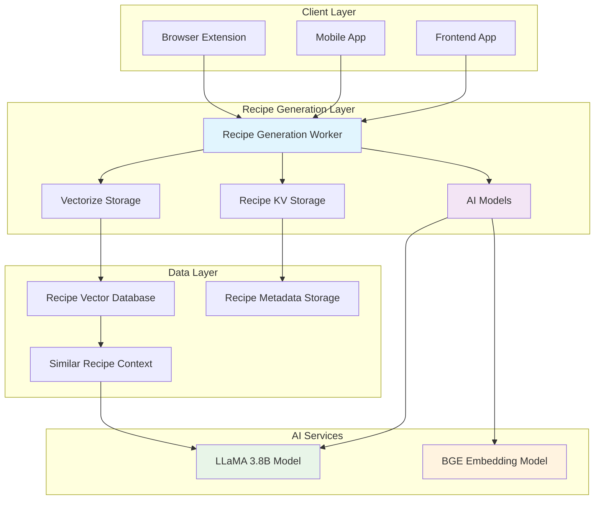
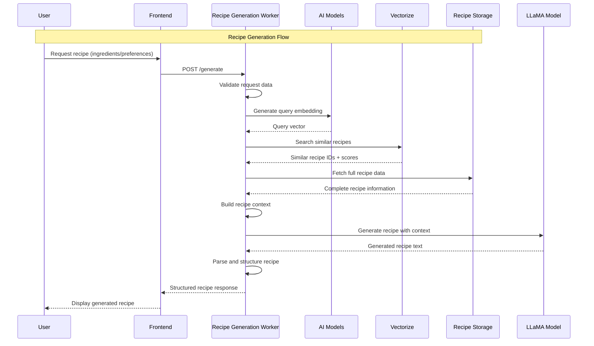
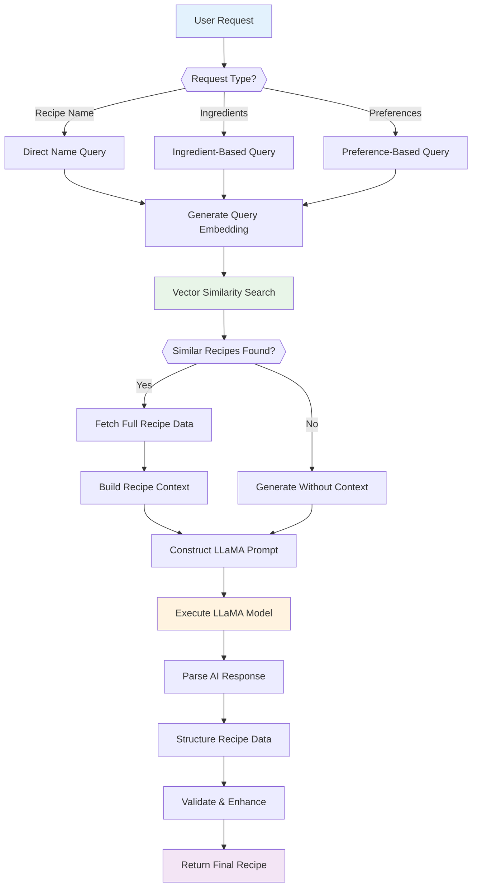
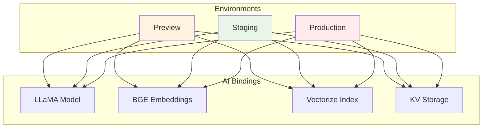
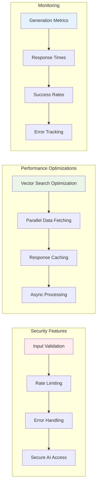
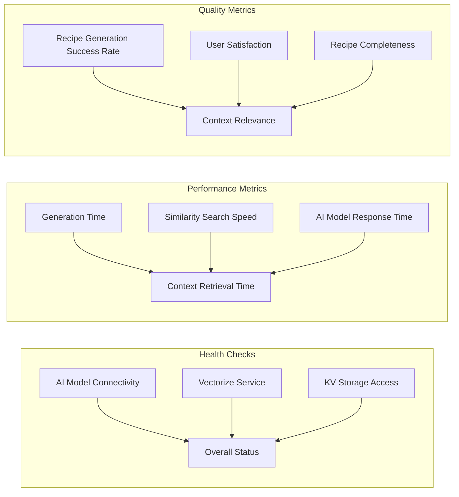

# Recipe Generation System Architecture

The Seasoned application's recipe generation system uses advanced AI technology to create personalized recipes based on user preferences, available ingredients, and culinary context. This system is implemented as a dedicated Cloudflare Worker that leverages vector embeddings, similarity search, and large language models to generate high-quality, contextual recipes.

## System Overview

## Recipe Generation Flow

## AI-Powered Architecture

## Key Components

### 1. **Recipe Generation Worker** (`recipe-generation-worker/`)
- **Purpose**: Generates personalized recipes using AI and vector similarity
- **Responsibilities**:
  - Process recipe generation requests
  - Generate query embeddings for similarity search
  - Retrieve contextual recipe data
  - Execute AI-powered recipe generation
  - Parse and structure generated recipes
- **Technologies**: Cloudflare Workers, AI Models, Vectorize, KV Storage

### 2. **AI Model Integration**
- **Embedding Model**: BGE Base EN v1.5 for semantic similarity
- **Generation Model**: LLaMA 3.8B Instruct for recipe creation
- **Context Window**: Leverages similar recipes for informed generation
- **Prompt Engineering**: Structured prompts for consistent recipe output

### 3. **Vector Similarity Search**
- **Storage**: Cloudflare Vectorize with recipe embeddings
- **Search Strategy**: Top-K similarity search (K=5)
- **Context Building**: Uses most similar recipes as generation context
- **Performance**: Optimized for sub-second response times

### 4. **Recipe Data Management**
- **Storage**: Cloudflare KV for recipe metadata and full content
- **Retrieval**: Efficient fetching of complete recipe information
- **Fallback**: Graceful degradation when full data unavailable
- **Caching**: Optimized data access patterns

## Data Flow Architecture

## Environment Configuration

The recipe generation worker supports multiple deployment environments:

## API Endpoints

| Endpoint | Method | Purpose | Request Body | Response |
|----------|--------|---------|--------------|----------|
| `/` | GET | Service information | None | Service details |
| `/health` | GET | Service health check | None | Health status |
| `/generate` | POST | Generate recipe | `{recipeName?, ingredients?, cuisine?, dietary?, servings?, mealType?, cookingMethod?, maxCookTime?}` | `{success: boolean, recipe: Recipe, environment: string}` |

## Recipe Generation Features

### 1. **Input Flexibility**
- **Recipe Name**: Direct recipe name queries
- **Ingredients**: Ingredient-based generation
- **Preferences**: Cuisine, dietary, time constraints
- **Hybrid**: Combination of multiple input types

### 2. **Context-Aware Generation**
- **Similar Recipe Context**: Uses vector similarity to find related recipes
- **Culinary Patterns**: Learns from existing recipe structures
- **Ingredient Compatibility**: Understands ingredient relationships
- **Cooking Methods**: Incorporates proven techniques

### 3. **AI Model Capabilities**
- **Structured Output**: Consistent recipe formatting
- **Measurement Accuracy**: Proper ingredient quantities
- **Instruction Clarity**: Step-by-step cooking directions
- **Time Estimation**: Realistic prep and cook times

## Security and Performance

## Error Handling and Fallbacks

### 1. **Graceful Degradation**
- **Mock Mode**: Local development without AI services
- **Partial Context**: Generation with limited recipe context
- **Fallback Parsing**: Robust recipe text parsing
- **Service Resilience**: Continues operation during partial failures

### 2. **Error Recovery**
- **Embedding Failures**: Fallback to text-based search
- **AI Model Errors**: Retry with simplified prompts
- **Data Fetch Errors**: Continue with available context
- **Validation Errors**: Provide helpful error messages

## Monitoring and Observability

## Future Enhancements

### 1. **Advanced AI Features**
- **Multi-Modal Generation**: Image-based recipe creation
- **Personalization**: User preference learning
- **Dietary Intelligence**: Advanced nutritional analysis
- **Cultural Adaptation**: Region-specific recipe variations

### 2. **Performance Improvements**
- **Model Optimization**: Smaller, faster AI models
- **Caching Strategy**: Intelligent response caching
- **Batch Processing**: Multiple recipe generation
- **Edge Optimization**: Distributed AI processing

### 3. **Integration Enhancements**
- **Recipe Validation**: AI-powered quality checking
- **User Feedback**: Learning from generation success
- **Collaborative Filtering**: Community-driven improvements
- **Real-time Updates**: Live recipe generation

This recipe generation architecture provides a sophisticated, AI-powered system that creates personalized, contextually relevant recipes while maintaining high performance, reliability, and user experience standards.