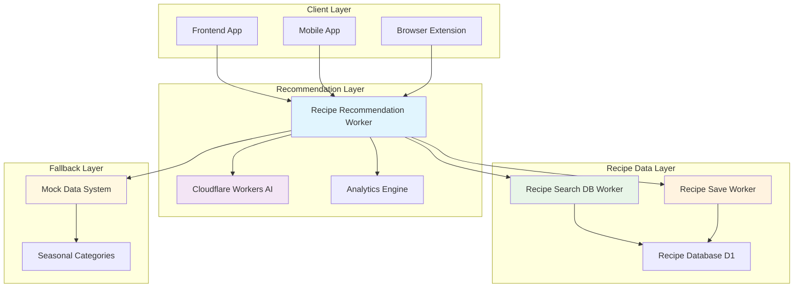
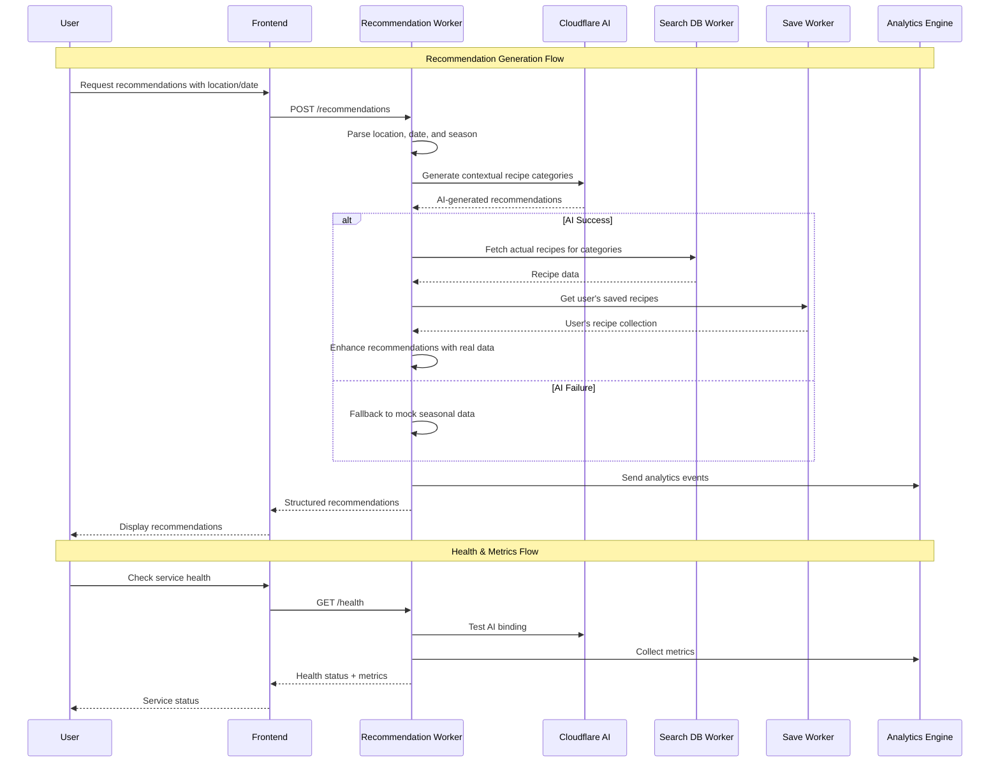
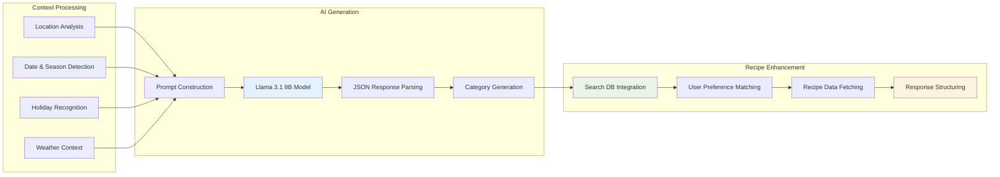
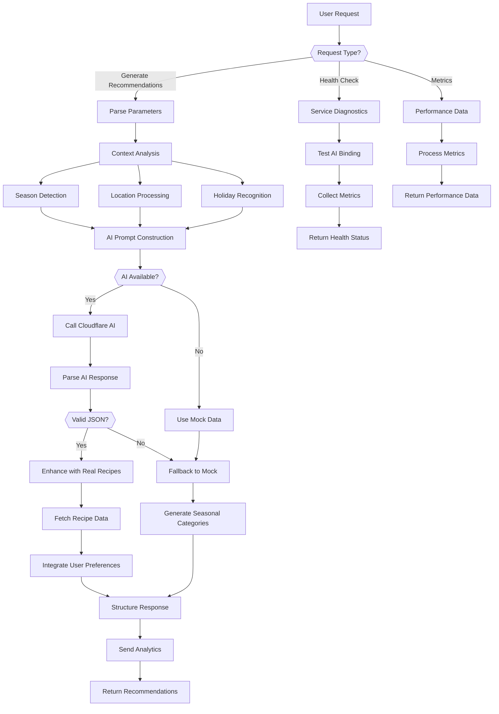
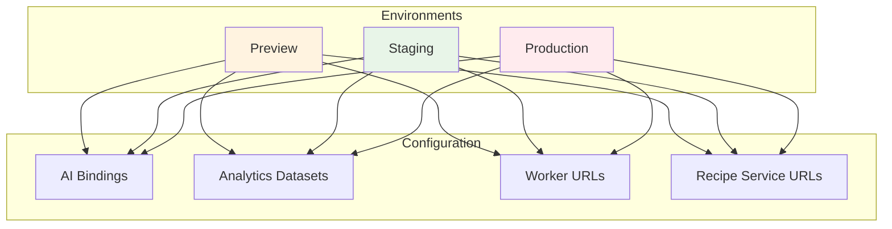
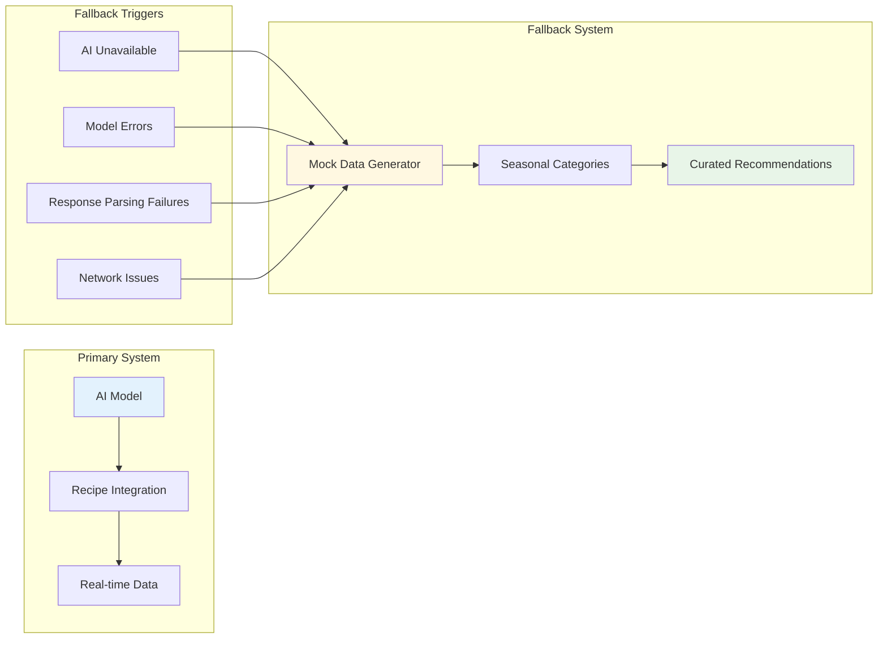
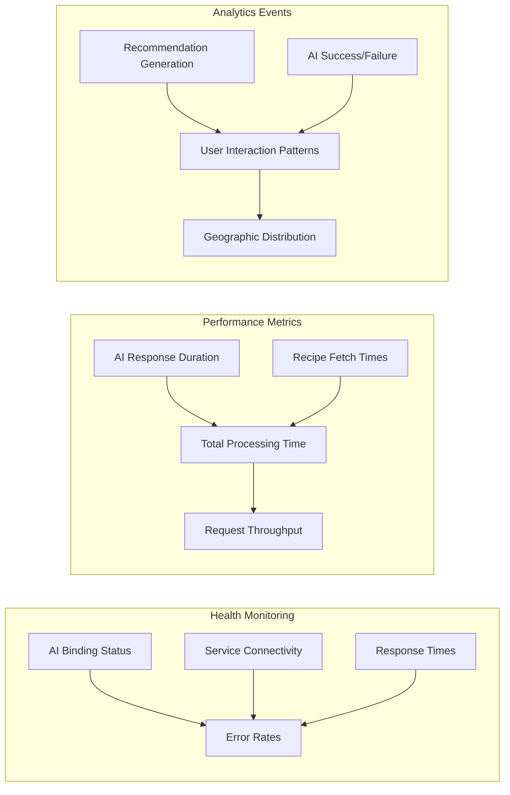

# Recipe Recommendation System Architecture

The Seasoned application's recipe recommendation system provides intelligent, context-aware recipe suggestions using Cloudflare Workers AI, implemented as a dedicated Cloudflare Worker with comprehensive observability and fallback mechanisms.

## System Overview

## Recommendation Flow

## AI-Powered Recommendation Architecture

## Key Components

### 1. **Recipe Recommendation Worker** (`recipe-recommendation-worker/`)
- **Purpose**: Generates intelligent recipe recommendations using AI and real recipe data
- **Responsibilities**:
  - Context-aware recommendation generation
  - AI model integration with Cloudflare Workers AI
  - Recipe data enhancement and integration
  - Comprehensive observability and monitoring
  - Fallback to curated mock data
- **Technologies**: Cloudflare Workers, Cloudflare Workers AI, Hono.js, Analytics Engine

### 2. **AI Recommendation Engine**
- **Model**: Llama 3.1 8B Instruct (via Cloudflare Workers AI)
- **Context Processing**: Location, date, season, holidays, weather
- **Prompt Engineering**: Dynamic prompt construction with contextual information
- **Response Parsing**: JSON extraction and validation with fallback handling
- **Performance**: Optimized token limits and response processing

### 3. **Recipe Data Integration**
- **Search Integration**: Fetches actual recipes from Recipe Search DB Worker
- **User Data**: Integrates with Recipe Save Worker for personalized recommendations
- **Data Enhancement**: Combines AI-generated categories with real recipe data
- **Fallback System**: Curated seasonal recommendations when AI is unavailable

### 4. **Observability & Analytics**
- **Structured Logging**: JSON-formatted logs with request tracking
- **Performance Metrics**: AI response times, parsing duration, total processing time
- **Analytics Engine**: Cloudflare Analytics for usage patterns and performance
- **Health Monitoring**: AI binding status and service diagnostics
- **Request Tracking**: Unique IDs for end-to-end tracing

## Data Flow Architecture

## Environment Configuration

The recipe recommendation worker supports multiple deployment environments:

## API Endpoints

| Endpoint | Method | Purpose | Request Body | Response |
|----------|--------|---------|--------------|----------|
| `/health` | GET | Service health check with AI status | None | Health status + metrics |
| `/metrics` | GET | Real-time performance metrics | None | Performance data + analytics |
| `/recommendations` | POST | Generate AI-powered recommendations | `{location, date, limit}` | Structured recommendations + recipes |

## AI Model Architecture

### 1. **Model Selection**
- **Primary**: Llama 3.1 8B Instruct (faster, more reliable)
- **Fallback**: Automatic degradation to mock data
- **Optimization**: Token limits optimized for response quality

### 2. **Prompt Engineering**
- **Context Integration**: Location, season, date, holidays
- **Dynamic Construction**: Adaptive prompts based on available information
- **Category Guidelines**: Creative, descriptive category naming
- **JSON Formatting**: Structured output with validation

### 3. **Response Processing**
- **Content Extraction**: Multiple response format handling
- **JSON Parsing**: Robust parsing with fallback mechanisms
- **Validation**: Category and recipe count verification
- **Enhancement**: Integration with real recipe data

## Fallback System Architecture

## Security Features

1. **AI Service Security**
   - Cloudflare Workers AI integration (no external API keys)
   - Environment isolation and binding validation
   - Rate limiting and request validation

2. **Data Protection**
   - No sensitive user data storage
   - Secure worker-to-worker communication
   - Input validation and sanitization

3. **Operational Security**
   - Comprehensive error handling and logging
   - Graceful degradation for service failures
   - Audit trail for recommendation events

## Performance & Scalability

### 1. **Edge Deployment**
- **Global Distribution**: Cloudflare's edge network
- **Low Latency**: Sub-100ms response times
- **High Availability**: 99.9%+ uptime

### 2. **AI Optimization**
- **Model Selection**: Llama 3.1 8B for speed/quality balance
- **Token Management**: Optimized prompts for efficient responses
- **Caching**: Intelligent fallback to reduce AI calls

### 3. **Resource Management**
- **Memory Efficiency**: Optimized data structures
- **Request Handling**: Concurrent request processing
- **Error Recovery**: Fast fallback mechanisms

## Monitoring and Observability

### Key Metrics

1. **Performance Metrics**
   - `ai_request_duration`: AI model response times
   - `recommendations_duration`: Total recommendation generation time
   - `recipe_fetch_duration`: Recipe data integration time
   - `request_duration`: End-to-end request processing

2. **Success Metrics**
   - `ai_success`: Successful AI generations
   - `recommendations_generated`: Completed recommendations
   - `fallback_usage`: Mock data fallback frequency

3. **Error Metrics**
   - `ai_errors`: AI model failures by type
   - `parsing_errors`: JSON parsing failures
   - `network_errors`: Service integration failures

## Integration Points

### 1. **Recipe Search DB Worker**
- **Purpose**: Fetch actual recipe data for AI-generated categories
- **Integration**: HTTP calls with authentication
- **Data Flow**: Category → Recipe search → Enhanced recommendations

### 2. **Recipe Save Worker**
- **Purpose**: Access user's saved recipes for personalization
- **Integration**: Worker-to-worker communication
- **Data Flow**: User preferences → Recommendation enhancement

### 3. **Analytics Engine**
- **Purpose**: Performance monitoring and usage analytics
- **Integration**: Cloudflare Analytics Engine binding
- **Data Flow**: Real-time metrics → Analytics dashboard

This architecture provides a robust, scalable, and intelligent recipe recommendation system that leverages AI for contextual suggestions while maintaining high reliability through comprehensive fallback mechanisms and observability features.