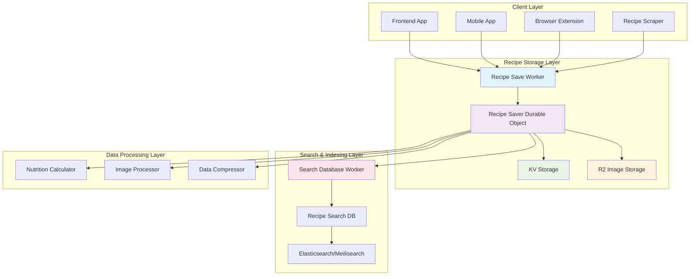
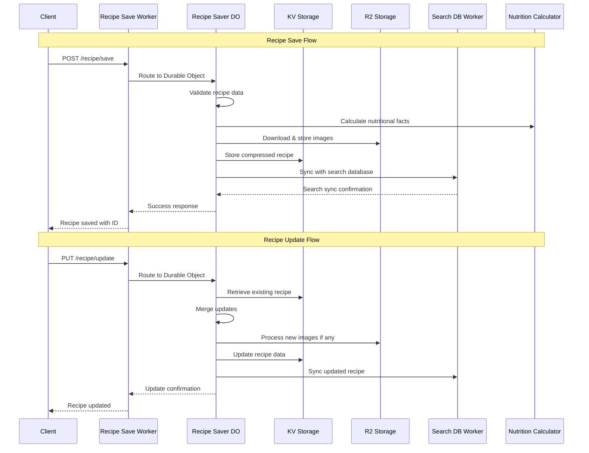
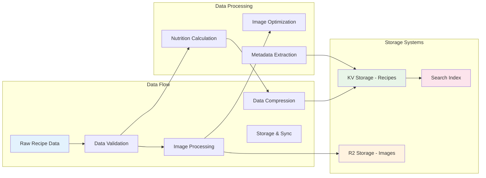
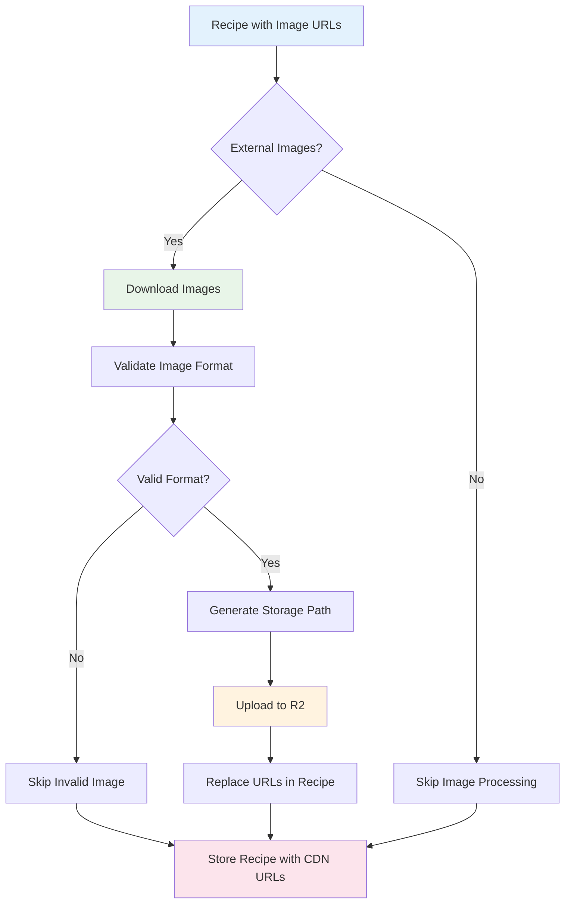
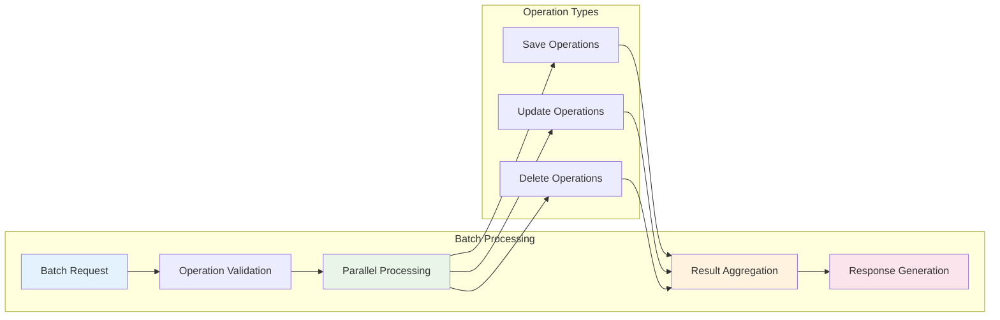
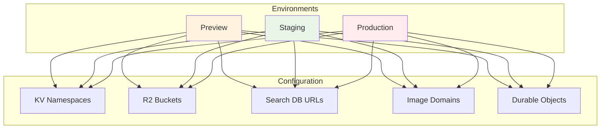
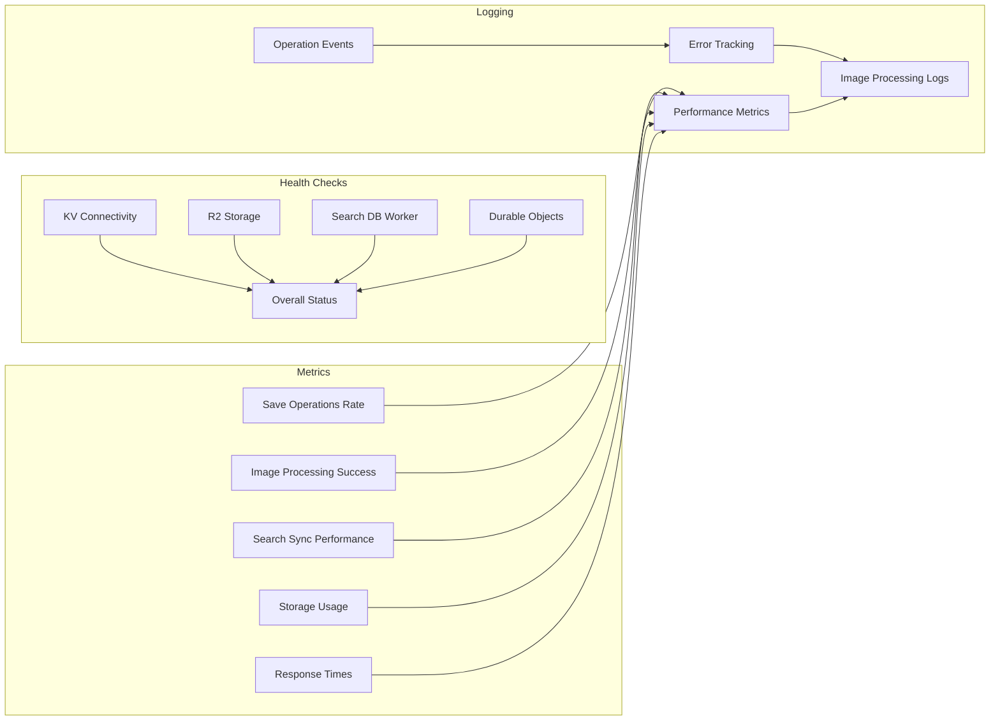
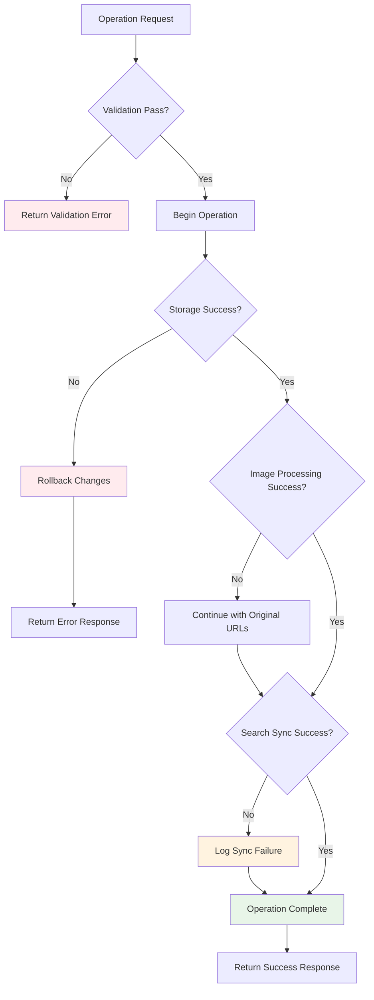

# Recipe Save System Architecture

The Seasoned application uses a robust recipe storage system built around Cloudflare Workers with Durable Objects, providing atomic operations, automatic search database synchronization, and intelligent image processing.

## System Overview



## Recipe Save Flow



## Data Architecture



## Key Components

### 1. **Recipe Save Worker** (`recipe-save-worker/`)
- **Purpose**: Main entry point for recipe operations
- **Responsibilities**:
  - Request routing and CORS handling
  - Durable Object coordination
  - Batch operation processing
  - Health monitoring and logging
- **Technologies**: Cloudflare Workers, Hono.js, Durable Objects

### 2. **Recipe Saver Durable Object** (`RecipeSaver`)
- **Purpose**: Ensures atomic operations and data consistency
- **Responsibilities**:
  - Atomic recipe saves, updates, and deletes
  - Image processing and R2 storage
  - Search database synchronization
  - Operation status tracking
- **Key Features**:
  - Prevents race conditions
  - Guarantees write atomicity
  - Handles complex multi-step operations

### 3. **Storage Systems**
- **KV Storage**: Compressed recipe data with metadata
- **R2 Storage**: Optimized image storage with CDN delivery
- **Search Database**: Real-time search indexing and synchronization

### 4. **Data Processing Pipeline**
- **Nutrition Calculator**: Parses ingredients and calculates nutritional facts
- **Image Processor**: Downloads, optimizes, and stores external images
- **Data Compressor**: Reduces storage footprint while maintaining accessibility

## API Architecture

```mermaid
graph TB
    subgraph "API Endpoints"
        A[/health]
        B[/recipe/save]
        C[/recipe/update]
        D[/recipe/delete]
        E[/recipe/status]
        F[/batch]
    end
    
    subgraph "Request Flow"
        G[Client Request]
        H[Worker Router]
        I[Durable Object]
        J[Storage Operations]
        K[Search Sync]
    end
    
    G --> H
    H --> A
    H --> B
    H --> C
    H --> D
    H --> E
    H --> F
    
    B --> I
    C --> I
    D --> I
    E --> I
    F --> I
    
    I --> J
    I --> K
    
    style A fill:#e8f5e8
    style B fill:#e1f5fe
    style C fill:#e1f5fe
    style D fill:#e1f5fe
    style E fill:#e1f5fe
    style F fill:#f3e5f5
```

## Image Processing Architecture



## Batch Operations Architecture



## Environment Configuration

The recipe save worker supports multiple deployment environments:



## API Endpoints

| Endpoint | Method | Purpose | Request Body | Response |
|----------|--------|---------|--------------|----------|
| `/health` | GET | Service health check | None | Health status |
| `/recipe/save` | POST | Save new recipe | `{recipe: object, options?: object}` | `{success: boolean, id: string, recipe: object}` |
| `/recipe/update` | PUT | Update existing recipe | `{recipeId: string, updates: object}` | `{success: boolean, recipe: object}` |
| `/recipe/delete` | DELETE | Delete recipe | `{recipeId: string}` | `{success: boolean}` |
| `/recipe/status` | GET | Check operation status | `?id=string` | `{status: string, data?: object}` |
| `/batch` | POST | Process multiple operations | `{operations: array}` | `{results: array}` |

## Data Models

### Recipe Structure
```typescript
interface Recipe {
  id: string;                    // Generated hash from URL
  url: string;                   // Original recipe URL
  title: string;                 // Recipe title
  description?: string;          // Recipe description
  ingredients: string[];         // List of ingredients
  instructions: string[];        // Cooking steps
  prepTime?: string;             // Preparation time
  cookTime?: string;             // Cooking time
  servings?: string;             // Number of servings
  cuisine?: string;              // Cuisine type
  tags?: string[];               // Recipe tags
  imageUrl?: string;             // Main image (CDN URL)
  images?: string[];             // Step-by-step images (CDN URLs)
  author?: string;               // Recipe author
  nutritionalFacts?: object;     // Calculated nutrition data
  _originalImageUrls?: string[]; // Original external URLs
  _metadata: {                   // System metadata
    createdAt: string;
    updatedAt: string;
    version: number;
    compressed: boolean;
  };
}
```

### Operation Status
```typescript
interface OperationStatus {
  status: 'pending' | 'processing' | 'completed' | 'failed';
  operationId: string;
  recipeId?: string;
  data?: any;
  error?: string;
  timestamp: string;
  duration?: number;
}
```

## Security Features

1. **Data Validation**
   - Comprehensive input validation
   - URL sanitization and validation
   - Image format verification
   - Size and content type restrictions

2. **Storage Security**
   - Compressed data storage
   - Secure image processing
   - Access control through environment isolation
   - No sensitive data exposure

3. **Operational Security**
   - Atomic operations prevent data corruption
   - Comprehensive error handling and logging
   - Rate limiting and request validation
   - CORS configuration for cross-origin requests

## Monitoring and Observability



## Performance Optimizations

1. **Data Compression**
   - Recipe data compression before KV storage
   - Efficient serialization/deserialization
   - Metadata optimization

2. **Image Processing**
   - Parallel image downloads
   - Format validation and optimization
   - CDN delivery for fast access

3. **Batch Operations**
   - Parallel processing of multiple operations
   - Efficient error handling and rollback
   - Optimized response aggregation

4. **Caching Strategy**
   - R2 CDN caching for images
   - KV storage optimization
   - Search database indexing

## Error Handling and Resilience



## Future Enhancements

1. **Advanced Image Processing**
   - AI-powered image optimization
   - Automatic image tagging
   - Thumbnail generation

2. **Enhanced Search Integration**
   - Real-time search updates
   - Advanced indexing strategies
   - Search analytics

3. **Performance Monitoring**
   - Detailed performance metrics
   - Automated scaling
   - Cost optimization

4. **Data Analytics**
   - Recipe popularity tracking
   - Usage pattern analysis
   - Performance insights

This architecture provides a robust, scalable, and maintainable solution for recipe storage while ensuring data consistency, automatic synchronization, and efficient image processing.