# Recipe Search System Architecture

The Seasoned application uses a sophisticated graph-based search system built around Cloudflare D1, implemented as a dedicated Cloudflare Worker that provides powerful recipe discovery, relationship mapping, and semantic search capabilities.

## System Overview

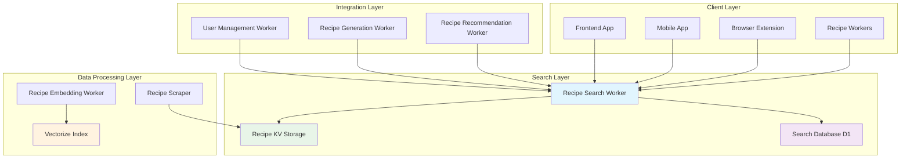

## Search Architecture

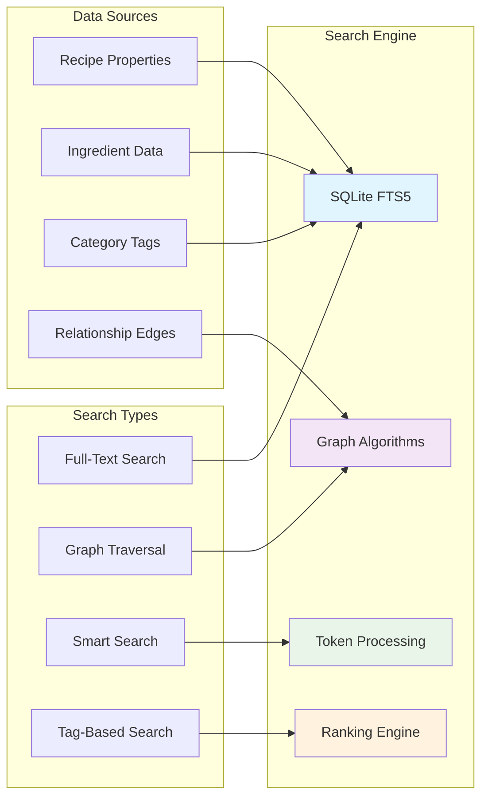

## Data Flow Architecture

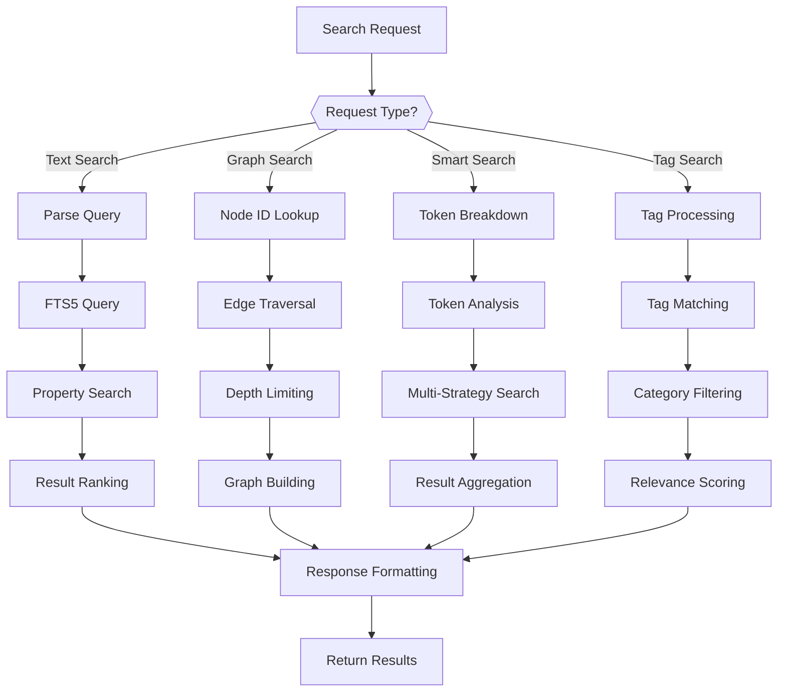

## Database Schema Architecture

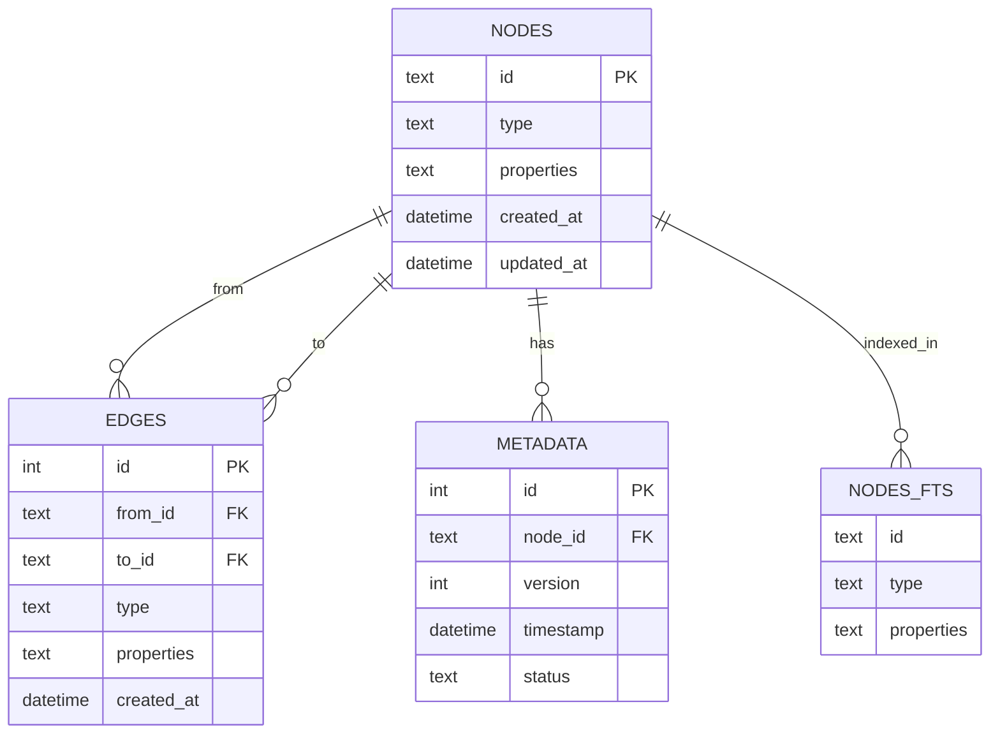

## Key Components

### 1. **Recipe Search Worker** (`recipe-search-db/`)
- **Purpose**: Central search engine for recipe discovery and relationship mapping
- **Responsibilities**:
  - Full-text search across recipe properties
  - Graph traversal and relationship discovery
  - Smart search with token breakdown strategies
  - Tag-based filtering and categorization
  - KV migration and data synchronization
- **Technologies**: Cloudflare Workers, D1 Database, SQLite FTS5

### 2. **Graph Database System**
- **Storage**: Cloudflare D1 with SQLite FTS5 integration
- **Structure**: Node-edge graph model for flexible relationships
- **Features**: Bidirectional traversal, soft deletes, versioning
- **Performance**: Optimized indexes, prepared statements, pagination

### 3. **Search Engine Architecture**
- **Full-Text Search**: SQLite FTS5 for powerful text queries
- **Graph Traversal**: Depth-limited relationship navigation
- **Smart Search**: Multi-strategy token processing
- **Tag System**: Flexible categorization and filtering

### 4. **Data Integration System**
- **KV Migration**: Automatic import from Cloudflare KV storage
- **Batch Processing**: Efficient handling of large datasets
- **Relationship Building**: Automatic edge creation during migration
- **Progress Tracking**: Real-time migration monitoring

## Search Capabilities

### Full-Text Search
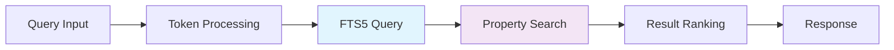

### Graph Traversal
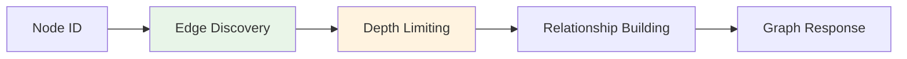

### Smart Search
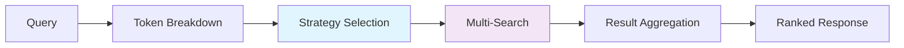

## API Architecture

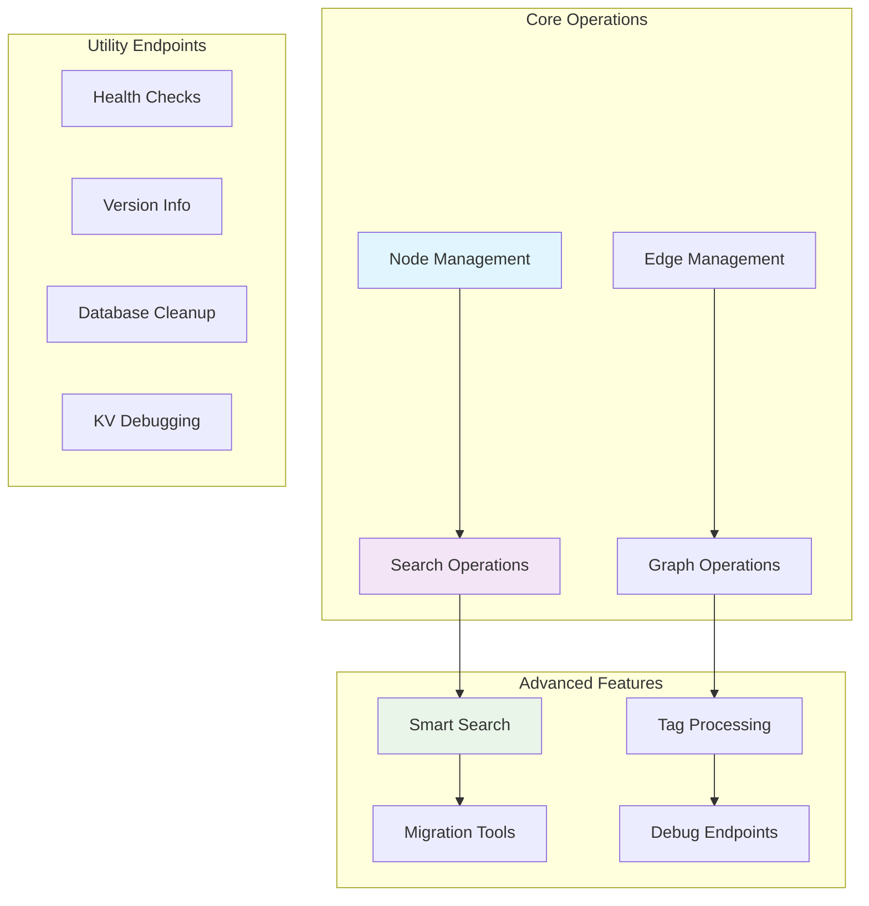

## Environment Configuration

The search worker supports multiple deployment environments:

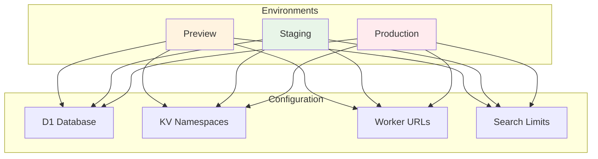

## API Endpoints

| Endpoint | Method | Purpose | Request Body | Response |
|----------|--------|---------|--------------|----------|
| `/api/health` | GET | Service health check | None | Health status |
| `/api/version` | GET | API version and features | None | Version info |
| `/api/nodes` | POST | Create new node | `{id, type, properties}` | Node data |
| `/api/nodes` | GET | List nodes with filtering | Query params | Node list |
| `/api/nodes/:id` | GET | Get specific node | None | Node data |
| `/api/nodes/:id` | PUT | Update node | `{properties}` | Updated node |
| `/api/nodes/:id` | DELETE | Soft delete node | None | Success status |
| `/api/edges` | POST | Create relationship | `{from_id, to_id, type, properties}` | Edge data |
| `/api/edges` | GET | List edges with filtering | Query params | Edge list |
| `/api/edges/:id` | DELETE | Delete relationship | None | Success status |
| `/api/search` | GET | Full-text search | Query params | Search results |
| `/api/smart-search` | GET | Advanced search | Query params | Smart results |
| `/api/graph` | GET | Graph traversal | Query params | Graph data |
| `/api/migrate-kv` | POST | KV migration | None | Migration status |

## Search Features

1. **Text Search Capabilities**
   - Full-text search across all node properties
   - Partial word matching and fuzzy search
   - Relevance ranking and scoring
   - Type filtering for targeted results

2. **Graph Intelligence**
   - Bidirectional relationship traversal
   - Depth-limited graph exploration
   - Relationship type filtering
   - Circular reference detection

3. **Smart Search Strategies**
   - Token breakdown and analysis
   - Multi-strategy search execution
   - Result aggregation and ranking
   - Context-aware query processing

4. **Tag and Category System**
   - Flexible tag assignment
   - Multi-tag search support
   - Category hierarchy navigation
   - Tag-based filtering

## Performance Architecture

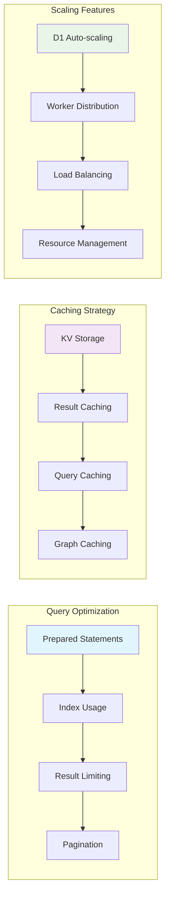

## Security Features

1. **Input Validation**
   - Comprehensive input sanitization
   - SQL injection protection
   - JSON schema validation
   - Type checking and validation

2. **Access Control**
   - CORS configuration
   - Rate limiting considerations
   - Authentication ready
   - Environment isolation

3. **Data Protection**
   - Soft delete support
   - Version tracking
   - Audit trail maintenance
   - Secure data handling

## Monitoring and Observability

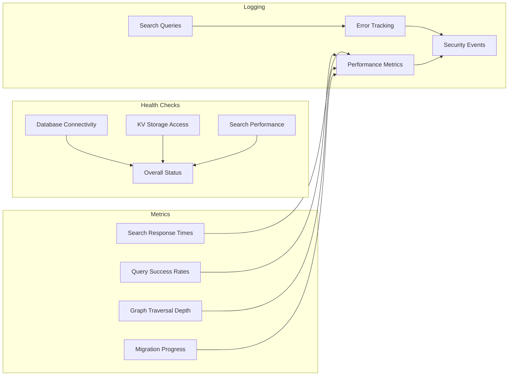

## Migration and Data Management

### KV Migration Process
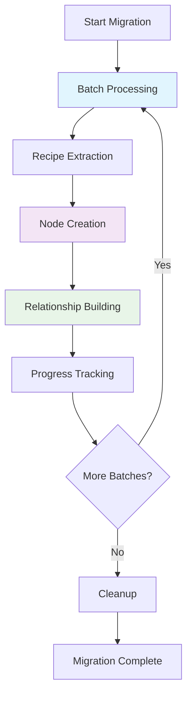

### Data Synchronization
- **Automatic Updates**: Real-time data synchronization
- **Conflict Resolution**: Smart handling of data conflicts
- **Performance Optimization**: Efficient batch processing
- **Error Recovery**: Graceful handling of migration failures

## Future Enhancements

1. **Advanced Search**
   - Semantic search with embeddings
   - Machine learning ranking
   - Natural language processing
   - Voice search capabilities

2. **Real-time Features**
   - WebSocket support
   - Live data updates
   - Collaborative filtering
   - Real-time recommendations

3. **Analytics and Insights**
   - Search pattern analysis
   - Popularity tracking
   - Trend identification
   - User behavior insights

4. **Integration Expansion**
   - External recipe databases
   - Social media integration
   - Mobile app support
   - API marketplace

This search architecture provides a powerful, scalable, and maintainable solution for recipe discovery while maintaining clean separation of concerns and following modern database design principles.